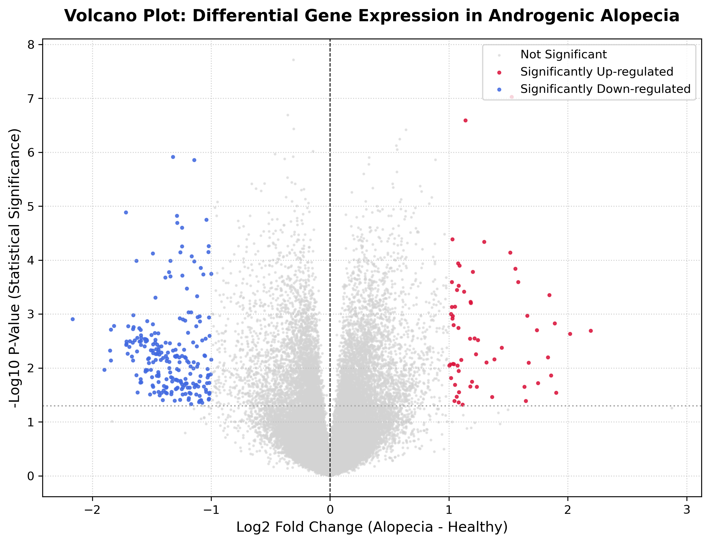

# Differential gene Expression Analysis Pipeline: Androgenic Alopecia (AGA)
A computational biology pipeline written in Python to preprocess, normalize and perform statistical transcriptomic profiling on public microarray datasets to isolate genetic switches flipped in androgenic-mediated hair follicle miniaturization.

## Proyect overview
This proyect processes raw expression matrices from the NCBI Gene Expression Omnibus (GEO) database, specifically dataset **GSE90594**. The analysis compares scalp skin biopsies from patients diagnosed with **Androgenic Alopecia (AGA)** against healthy control subjects to map significantly altered molecular pathways and localized micro-inflammation.
* **Total Probes Evaluated:** 46,204 rows
* **Androgenic Alopecia Samples:** 14
* **Healthy Control Samples:** 14
* **Statistical Threshold Used:** Welch's T-Test (p < 0.05)

## Visualisations: The Volcano Plot
By plotting the magnitude of change (Log2 Fold Change) against statistical reliability (-Log10 P-Value), the pipeline isolates up-regulated biomarkers (red) and down-regulated signatures (blue) out of thousands of neutral genes (gray).

### Key Biological Insights From My Analysis:
* **FCRL5 (Fc Receptor Like 5):** Isolated as the absolute top up-regulated marker (Fold Change = 2.19 , p=0.0020). This points towards dense B-cells/ lymphocyte immune presence, indicating perifollicular micro-inflammation during active hair loss.
* **TNFRSF17 (Tumor Necrosis Factor Receptor Superfamily Member 17):** Heavily up-regulated with an incredibly robust statistical confidence (Fold Change = 1.84 , p=0.0004). TNF superfamily pathways are classic indicators of tissue stress responses.

## Pipeline Architecture & Methodology
The data science workflow was engineered from scratch using vectorized matrix math to optimize performance and prevent row-by-row memory leaks:
**Data Intake:** Loaded raw series matrix files using memory chunk handling via Pandas.
**Annotation Alignment:** Merged experimental arrays with official GPL17077 probe IDs while aggressively stripping unannotated control sequences.
**Data Scrubbing:** Handled non-numeric string representations and formatting anomalies natively via data coercion workflows (`pd.to_numeric`).
**Statistical Modeling:** Conducted dual-matrix independent Welch's T-Tests ($equal\_var=False$) across 46,204 rows simultaneously using raw NumPy arrays.
**Data Visualization:** Exported high-resolution figures using Matplotlib.

## 🚀 Execution Guide

### Prerequisites
Download and place the following raw files into your local working directory:
1. `GSE90594_series_matrix.txt.gz` (from NCBI GEO)
2. `GPL17077-17467.txt` (Platform annotation matrix)

### Run Analysis
python alopecia_analysis_final.py

*Developed as an independent research project to prepare for prospective computational biology TFG and internship options during my Erasmus exchange program.*

